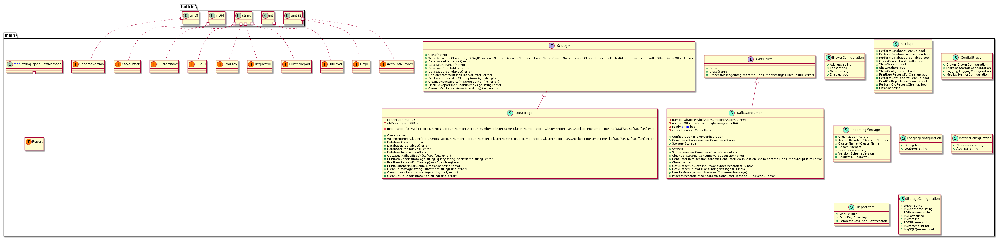
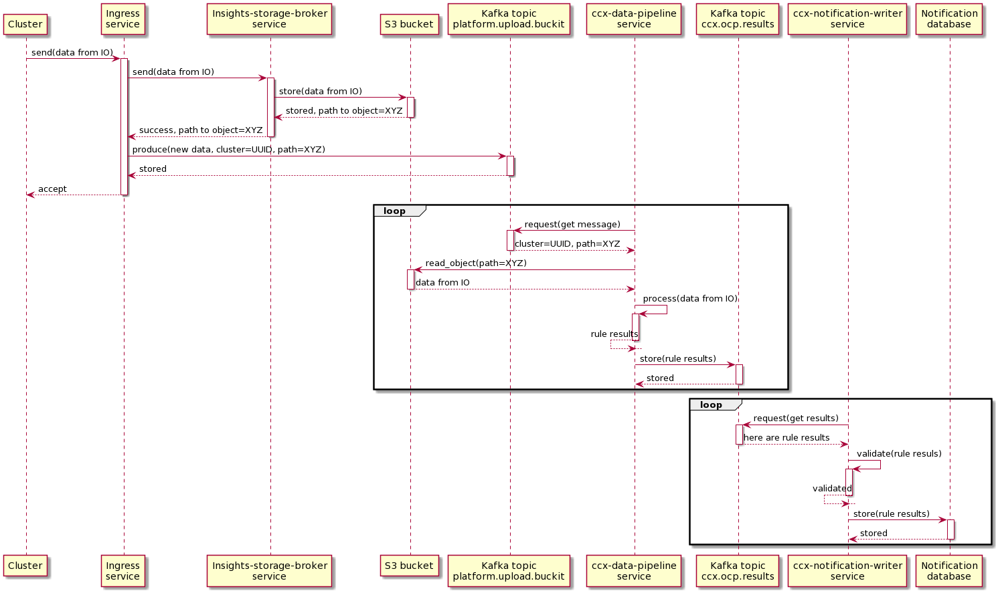

# Description

The main task for this service is to listen to configured Kafka topic, consume
all messages from such topic, and write OCP results (in JSON format) with
additional information (like organization ID, cluster name, Kafka offset etc.)
into database table named `new_reports`. Multiple reports can be consumed and
written into the database for the same cluster, because the primary (compound)
key for `new_reports` table is set to the combination `(org_id, cluster,
updated_at)`. When some message does not conform to expected schema (for
example if `org_id` is missing), such message is dropped and the error is
stored into log.

Additionally this service exposes several metrics about consumed and processed
messages. These metrics can be aggregated by Prometheus and displayed by
Grafana tools.

## Class diagram

[Class diagram, full scale](class_diagram.png)

## Sequence diagram

[Sequence diagram, full scale](sequence_diagram.png)

## Database description

* PostgreSQL database is used as a storage.
* Database description is available [here](./db-description/index.html)

## Documentation for source files from this repository

* [ccx_notification_writer.go](./packages/ccx_notification_writer.html)
* [config.go](./packages/config.html)
* [constants.go](./packages/constants.html)
* [consumer.go](./packages/consumer.html)
* [logging.go](./packages/logging.html)
* [metrics.go](./packages/metrics.html)
* [storage.go](./packages/storage.html)
* [types.go](./packages/types.html)

## Documentation for unit tests files fro this repository

* [ccx_notification_writer_test.go](./packages/ccx_notification_writer_test.html)
* [config_test.go](./packages/config_test.html)
* [constants_test.go](./packages/constants_test.html)
* [consumer_test.go](./packages/consumer_test.html)
* [logging_test.go](./packages/logging_test.html)
* [metrics_test.go](./packages/metrics_test.html)
* [storage_test.go](./packages/storage_test.html)
* [export_test.go](./packages/export_test.html)
